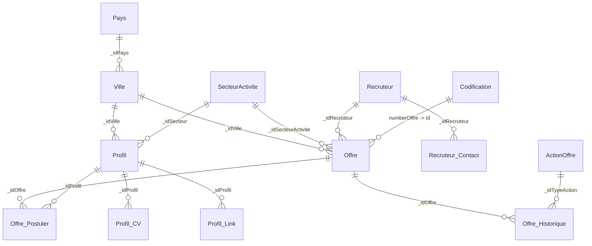

# JobzFactory SQL Database

Schema reverse-engineered from the Entity Framework model in `JF.DAL/Context/Model.edmx`.

Connection strings in the solution default to **SQL Server Express LocalDB** using `data source=(localdb)\MSSQLLocalDB` and **Windows authentication** (`integrated security=True`).

## Quick start (SQL scripts)

Run in SSMS or `sqlcmd` against your local instance (`(localdb)\MSSQLLocalDB`):

```text
Database\jobzFactory_CreateDatabase.sql
Database\jobzFactory_SeedData.sql
Database\jobzFactory_SampleData.sql        # dev/staging demo data only — NOT for production
```

> **Existing databases:** run `Database\jobzFactory_Migration_Phase2.sql` once before deploying the upgraded apps (widens `motPasse` to NVARCHAR(256) for PBKDF2 hashes and adds missing indexes). New databases from the DACPAC already include these.

## Quick start (DACPAC — recommended)

Requires **SSDT** (SQL Server Data Tools) in Visual Studio.

```powershell
cd Database
.\Build-Dacpac.ps1
.\Publish-LocalDatabase.ps1 -Server "(localdb)\MSSQLLocalDB"
```

Output: `Database\jobzFactory.Database\bin\Release\jobzFactory.Database.dacpac`

The post-deploy script loads **seed (lookup) data only**. Sample/demo data is intentionally not loaded by the DACPAC so production deployments start clean — run `jobzFactory_SampleData.sql` manually for a dev/staging dataset.

## Test accounts (sample data)

| Portal | Login | Password |
|--------|-------|----------|
| Recruteur | `recruteur.demo` | `123` |
| Recruteur | `tech.hr` | `123` |
| Administration | `admin` | `ChangeMe!2026` |

Sample data includes 2 recruiters and 1 candidate application. After `jobzFactory_EnglishJobs.sql`, all **40 English job listings** are owned by **`recruteur.demo`** (company: Demo Recrutement). `tech.hr` keeps its own draft offer only.

Passwords are stored as PBKDF2 hashes; legacy plaintext demo passwords are auto-upgraded on first login. **Change the admin password immediately on any real deployment.**

## Connection string (already applied)

All projects use the same EF6 connection:

```xml
<add name="jobzFactoryEntities"
     connectionString="metadata=res://*/Context.Model.csdl|res://*/Context.Model.ssdl|res://*/Context.Model.msl;provider=System.Data.SqlClient;provider connection string=&quot;data source=(localdb)\MSSQLLocalDB;initial catalog=jobzFactory;integrated security=True;MultipleActiveResultSets=True;App=EntityFramework&quot;"
     providerName="System.Data.EntityClient" />
```

Updated in:

- `JF.DAL/App.Config` (design-time only)
- `JobzFactory/Web.config`
- `Recruteur/Web.config`
- `Administration/Web.config`

If you use a **named SQL Express instance**, change `data source=(localdb)\MSSQLLocalDB` to `data source=.\SQLEXPRESS` in those files.

For **SQL authentication**, replace `integrated security=True` with `User ID=...;Password=...`. For production, set the real connection string via `Web.Release.config` transforms or Web Deploy SetParameters (see the root `README.md`).

## Entity relationship overview



## Drop and recreate (development only)

```sql
USE master;
ALTER DATABASE jobzFactory SET SINGLE_USER WITH ROLLBACK IMMEDIATE;
DROP DATABASE jobzFactory;
```

Then re-run scripts or `Publish-LocalDatabase.ps1`.
