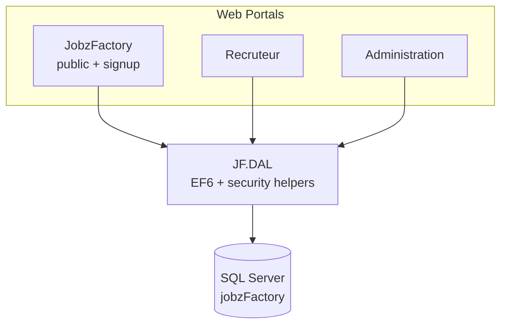

# JobzFactory

JobzFactory is a French job board platform built as a multi-portal ASP.NET MVC application. Candidates register, verify their email, log in, manage a profile and CV library, and apply to offers (once per offer) on the public site; recruiters manage listings and applications; and administrators maintain reference data and moderate content.

## Features

- **Public job site (`JobzFactory`)** — searchable listings with filters (title, city, sector), AJAX pagination, job detail pages, and a full candidate account area:
  - **Signup + email verification** (`/signup`) and **login** (`/login`) with a password set during registration
  - **Candidate dashboard** (`/profile`) — profile summary, application/CV stats, email verification status, saved CV library, recent applications, and matched offers
  - **Profile editing** (`/profile/edit`) — personal details, city, sector, and password change
  - **Applications history** (`/profile/applications`)
  - **CV library** — upload/delete/download reusable CVs; reuse a saved CV when applying
  - **Forgot / reset password** via emailed token
  - **Apply-once enforcement** — a candidate can apply to a given offer only once; the Apply page and job detail button switch to an "Applied" state
  - Prefilled application form (name, email, mobile) from the authenticated profile
- **Recruiter portal (`Recruteur`)** — dashboard, offer CRUD, publish/unpublish, candidate board, application history, signed CV download links
- **Admin portal (`Administration`)** — authenticated CRUD for recruiters and job offers
- **Shared data layer (`JF.DAL`)** — Entity Framework 6 database-first model, plus shared security helpers (password hashing, role authorization, CV tokens, HTML sanitization)
- **Database project (`jobzFactory.Database`)** — SSDT/DACPAC schema with seed data, indexes, and unique constraints

## Tech stack

| Layer | Technology |
|-------|------------|
| Framework | .NET Framework 4.7.2 |
| Web | ASP.NET MVC 5, Razor |
| ORM | Entity Framework 6 (Database First) |
| Database | SQL Server (LocalDB for dev) |
| Auth | Forms Authentication + PBKDF2 password hashing (JobzFactory candidates, Recruteur & Administration), shared `machineKey` |
| CI/CD | Azure Pipelines (`azure-pipelines.yml`) — 3 web packages + DACPAC |

## Solution structure

```
JobzFactory/
├── JobzFactory/          # Public job site + candidate signup/email verification
├── Recruteur/            # Recruiter portal
├── Administration/       # Admin portal (authenticated)
├── JF.DAL/               # Shared EF6 entities, DbContext, security & validation helpers
├── Database/             # SSDT project, create/seed/migration SQL scripts
├── scripts/              # Start-AllWebSites.ps1, Setup-LocalMachine.ps1
└── azure-pipelines.yml   # CI/CD: builds 3 web packages + the DACPAC
```

> The former standalone `Profil` project has been merged into `JobzFactory` (signup + email verification now live at `/signup` on the public site). It is no longer a separate portal.

## Prerequisites

- **Windows** with Visual Studio 2019 or 2022 (the repo was built with VS 2022 / MSBuild 17/18)
- **ASP.NET and web development** workload (includes IIS Express)
- **SQL Server** or **SQL Server Express LocalDB** (a LocalDB instance is assumed by default)
- **SSDT** (for building/publishing the `.dacpac`)

## Quick start

### 1. Clone the repository

```powershell
git clone https://github.com/senppai/JobzFactory.git
cd JobzFactory
```

### 2. Create the database

**Option A — DACPAC (recommended)**

```powershell
cd Database
.\Build-Dacpac.ps1
.\Publish-LocalDatabase.ps1 -Server "(localdb)\MSSQLLocalDB"
```

**Option B — SQL scripts**

Run in SQL Server Management Studio or `sqlcmd`, in order:

```text
Database\jobzFactory_CreateDatabase.sql
Database\jobzFactory_SeedData.sql
Database\jobzFactory_SampleData.sql      # dev/staging demo data only — NOT for production
```

See [`Database/README.md`](Database/README.md) for schema details, ER diagram, and connection string notes.

> **Existing databases:** before deploying the upgraded apps, run `Database\jobzFactory_Migration_Phase2.sql` once. It widens the `motPasse` columns to `NVARCHAR(256)` (so PBKDF2 hashes fit) and adds the missing indexes. New databases created from the DACPAC already include these changes.

### 3. Configure connection strings

All web projects use the same EF6 connection string. The default points at LocalDB:

```xml
data source=(localdb)\MSSQLLocalDB;initial catalog=jobzFactory;integrated security=True
```

Files to check if your instance differs:

- `JF.DAL/App.Config` (design-time only)
- `JobzFactory/Web.config`
- `Recruteur/Web.config`
- `Administration/Web.config`

For **SQL Express**, change `data source=(localdb)\MSSQLLocalDB` to `data source=.\SQLEXPRESS`.

### 4. Build and run

Open `JobzFactory.sln` in Visual Studio, restore NuGet packages, and build the solution.

**Run all portals at once (recommended)**

Visual Studio 2022 (17.11+):

1. **Tools → Options → Preview Features** → enable **Multi-Project Launch Profiles**
2. Select the **All Web Sites** startup profile
3. Press **F5**

Visual Studio 2019:

1. Right-click the solution → **Properties**
2. **Multiple startup projects** → set **JobzFactory**, **Recruteur**, and **Administration** to **Start**

**Without Visual Studio**

```powershell
.\scripts\Start-AllWebSites.ps1
```

Stop sites from the IIS Express tray icon.

## Local URLs

| Portal | URL |
|--------|-----|
| Public site + candidate account | http://localhost:59579/ |
| Candidate login | http://localhost:59579/login |
| Candidate dashboard | http://localhost:59579/profile |
| Recruiter | http://localhost:60658/Login |
| Administration | https://localhost:44303/Account/Login |

Cross-portal links are configured in each project's `Web.config` (`UrlMain`, `UrlRecruteur`).

## Test accounts

Demo data is loaded by `jobzFactory_SampleData.sql` (dev/staging only — not loaded on production DACPAC publishes).

| Portal | Login | Password |
|--------|-------|----------|
| Recruteur | `recruteur.demo` | `123` |
| Recruteur | `tech.hr` | `123` |
| Administration | `admin` | `ChangeMe!2026` |

Passwords are stored as PBKDF2 hashes. Legacy plaintext passwords (from older demo data) are automatically upgraded to a hash on the first successful login, so existing accounts keep working after the migration — no forced reset required. **Change the admin password immediately on any real deployment** by generating a new hash with `JF.DAL.Security.PasswordHasher` and setting `AdminUsername` / `AdminPasswordHash` in `Administration/Web.config`.

## Email (candidate verification & password reset)

Candidate verification and password-reset emails are sent via SMTP configured in `JobzFactory/Web.config`:

```xml
<add key="Email" value="no-reply@jobzfactory.com" />
<add key="SenderName" value="JobzFactory" />
<add key="SmtpHost" value="smtp.gmail.com" />
<add key="SmtpPort" value="587" />
<add key="Password" value="" />   <!-- Gmail App Password; set on the server only -->
```

If you use Gmail, create a [Google App Password](https://myaccount.google.com/apppasswords) (requires 2-Step Verification). **Do not commit real credentials** — set the password through an environment-specific config on the server only.

## Architecture



Each portal is a separate IIS site with its own routes and Forms Authentication. They share the same database through `JF.DAL`.

## Build & deploy

### Local command-line build

```powershell
nuget restore JobzFactory.sln
msbuild JobzFactory.sln /p:Configuration=Release
```

### CI/CD (Azure Pipelines)

`azure-pipelines.yml` runs on `windows-latest` for pushes to `main` and produces a single `drop` artifact containing:

- `JobzFactory.zip` — public site web deploy package (Release transform applied)
- `JobzFactory_Recruteur.zip` — recruiter portal web deploy package
- `JobzFactory_Administration.zip` — admin portal web deploy package
- `jobzFactory.Database.dacpac` — database schema

### Production deployment checklist

1. **Database**
   - For an existing DB: run `Database\jobzFactory_Migration_Phase2.sql`.
   - For a new DB: publish the DACPAC with `SqlPackage /Action:Publish /SourceFile:jobzFactory.Database.dacpac /TargetDatabaseName:jobzFactory /TargetServerName:PROD-SQL` (or `Publish-LocalDatabase.ps1`).
   - Do **not** load `jobzFactory_SampleData.sql` in production.
2. **Web apps** — deploy each zip via IIS Web Deploy (`msdeploy`) to three separate IIS sites.
3. **Configuration** — before going live, set in each site's `Web.config` (or via Web Deploy SetParameters / Azure DevOps XML variable substitution):
   - `connectionStrings/jobzFactoryEntities` → production SQL Server (SQL auth recommended)
   - `UrlMain` / `UrlRecruteur` → production domains
   - `CvTokenSecret` (Recruteur & JobzFactory) → a strong, unique shared secret
   - `AdminUsername` / `AdminPasswordHash` (Administration) → real admin credentials
   - `Password` (JobzFactory email) → SMTP credentials
   - `machineKey` → explicit, identical keys across portals (so auth tickets are valid)
   - `requireSSL="true"` on `<forms>` and `<httpCookies>` (already set in `Web.Release.config`)
4. **HTTPS** — serve all three portals over HTTPS only; HSTS headers are already emitted.

## Documentation

- [`Database/README.md`](Database/README.md) — schema, deployment, test data

## Security notes

- Passwords are hashed with PBKDF2 (`JF.DAL.Security.PasswordHasher`); legacy plaintext is auto-upgraded on first login.
- Administration is protected by Forms Authentication + an `Admin` role (`AdminAuthorizeAttribute`); default credentials must be changed on deploy.
- CV files are served through `RessourceController.ApplicationCv` only with a valid HMAC-signed, time-limited token (`JF.DAL.Security.CvToken`) — no sequential-ID enumeration.
- File uploads are validated server-side (extension whitelist, max 10 MB) and path traversal is blocked in `CvStorage`.
- User-generated HTML is sanitized before rendering (`JF.DAL.Security.HtmlSanitizer` / `@Html.Sanitize`).
- Security headers (`X-Content-Type-Options`, `X-Frame-Options`, `Referrer-Policy`, `Strict-Transport-Security`) are emitted on all portals; cookies are `HttpOnly` + `SameSite`.

## License

This project was developed as a PFE (final year project). Add a license file if you intend to open-source or share the repository publicly.

## Author

Oussama Fisly — PFE project, JobzFactory job board platform.
